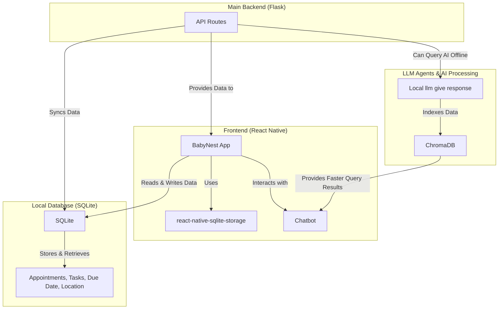

# BabyNest

<!-- Organization Logo -->

  
  <!--  -->

&nbsp;

<!-- Organization Name -->

<!-- Correct deployed url to be added -->

<!-- Organization/Project Social Handles -->

<!-- X (formerly Twitter) -->

&nbsp;&nbsp;
<!-- Discord -->

&nbsp;&nbsp;

## Table of Contents

1. [Overview](#overview)
2. [Features](#features)
3. [Tech Stack](#tech-stack)
5. [Usage](#usage)
6. [Components](#components)
4. [Architecture](#architecture)
7. [Contact](#contact)

## Overview

**BabyNest** is a minimalist React Native application designed to support expecting parents by tracking prenatal medical appointments, providing country-specific healthcare requirement notifications, and delivering AI-powered personalized recommendations. This intelligent pregnancy planner ensures parents stay informed, organized, and stress-free throughout their journey.

## Features

- **Automated Trimester Tracking**: Keeps track of medical appointments based on the pregnancy timeline.
- **Country-Specific Notifications**: Alerts users about healthcare requirements specific to their region.
- **Offline Access**: Provides essential pregnancy care guidelines without requiring internet access.
- **AI-Powered Assistant**: Offers personalized recommendations, reminders, and scheduling assistance.

## Tech Stack

- **Frontend**: React Native
- **Backend**: Flask (Python)
- **AI & NLP**: Python, LangChain
- **Database**: SQLite

## Usage

- Open the mobile app on an emulator or device.
- Sign up and input the estimated due date to personalize your experience.
- Get notified of upcoming medical appointments and tasks.
- Access offline pregnancy care guidelines.
- Interact with the AI assistant for advice and recommendations.

## Components

### Frontend

- Built using **React Native** for a seamless mobile experience.
- Provides a clean and intuitive UI to track pregnancy milestones.
- Supports offline mode for essential features.

### Backend

- Developed using Flask\*\*(Python)\*\* for fast and efficient API interactions.
- Handles appointment scheduling and task management.
- Provides data syncing when the user is online.

### AI & NLP

- **LangChain** is used to power the AI assistant for personalized insights.
- Supports natural language queries to search for symptoms, medications, and appointments.

### Database

- Uses **SQLite** for local data storage to support offline functionality.
- Stores user information, appointment schedules, and task lists.

# Architecture

This diagram illustrates the architecture of BabyNest.

## Contributing

We welcome contributions of all kinds! To contribute:

1. Fork the repository and create your feature branch (`git checkout -b feature/AmazingFeature`).
2. Commit your changes (`git commit -m 'Add some AmazingFeature'`).
3. Run the development workflow commands to ensure code quality
4. Push your branch (`git push origin feature/AmazingFeature`).
5. Open a Pull Request for review.

If you encounter bugs, need help, or have feature requests:

- Please open an issue in this repository providing detailed information.
- Describe the problem clearly and include any relevant logs or screenshots.

We appreciate your feedback and contributions!

## Contact

For any inquiries or support, please reach out to us on [Discord](#).

